# Coworking App

A modern coworking platform built with **Next.js 16**, **TypeScript**, **Supabase**, **Stripe**, and **OpenRouter AI**.

Users can browse workspaces, rent offices, contact owners with AI assistance, and securely complete payments through Stripe Checkout.

---

##  Live Demo

https://co-working-next-js.vercel.app

---

# Screenshots

##  Homepage

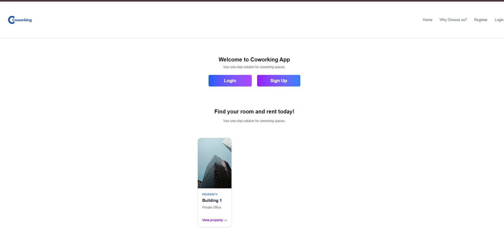
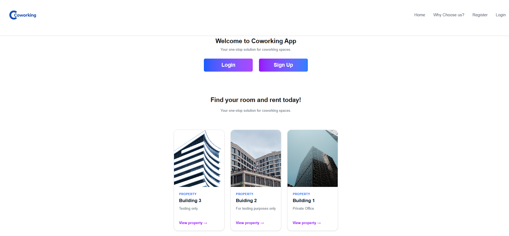

---

## Login

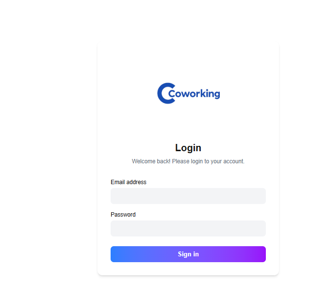

---

## Register

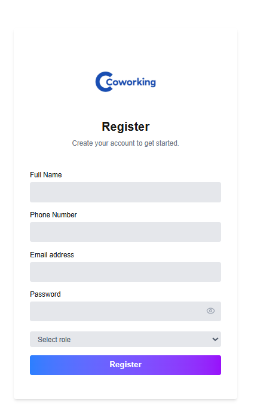

---

## Owner Dashboard

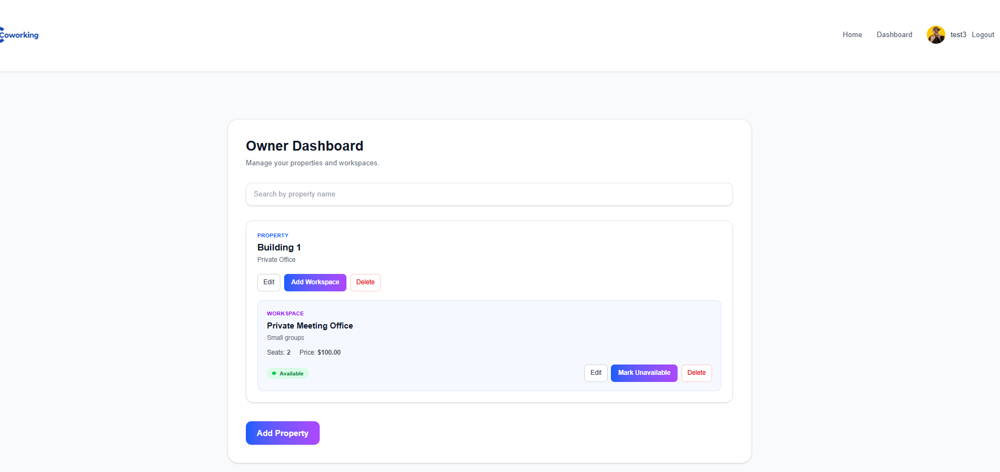
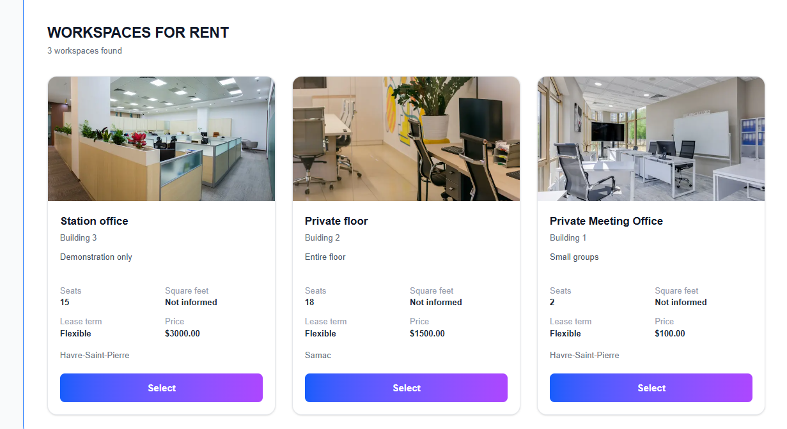

---

##  Coworker Dashboard

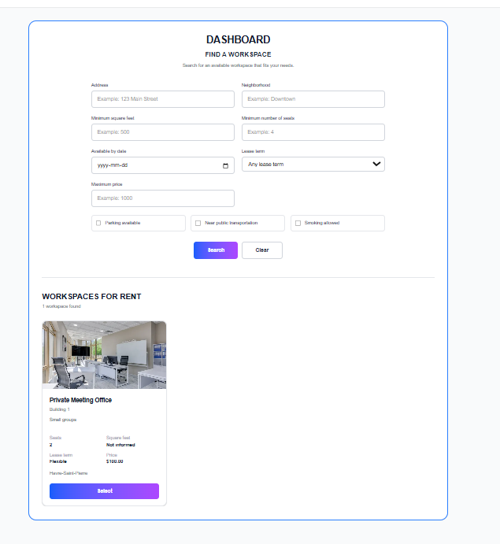
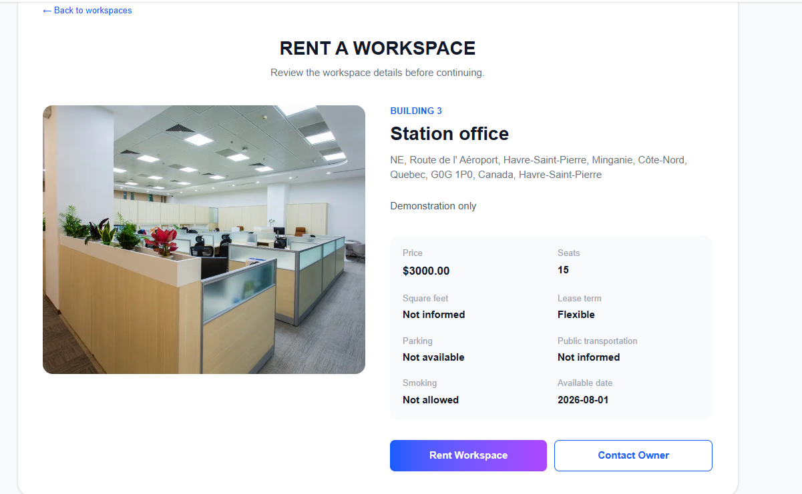


## Authentication

- User Registration
- Login / Logout
- Protected Routes
- Session Management

---

## Property Management

Owners can:

- Create properties
- Edit properties
- Delete properties
- Upload images
- View all owned properties

---

## Workspace Management

Owners can:

- Create workspaces
- Edit workspaces
- Delete workspaces
- Mark workspace as available/unavailable
- Upload workspace images

---

## Coworker Features

Coworkers can:

- Browse available workspaces
- Filter by:

  - Address
  - Neighborhood
  - Price
  - Seats
  - Lease Term
  - Parking
  - Public Transportation
  - Smoking Allowed
  - Available Date

- View workspace details
- Contact workspace owners
- Complete secure Stripe payments

---

##  AI Assistant

Integrated with **OpenRouter AI**.

The assistant:

- Guides users before contacting an owner
- Collects user needs
- Generates an AI summary
- Saves the conversation
- Emails the owner automatically

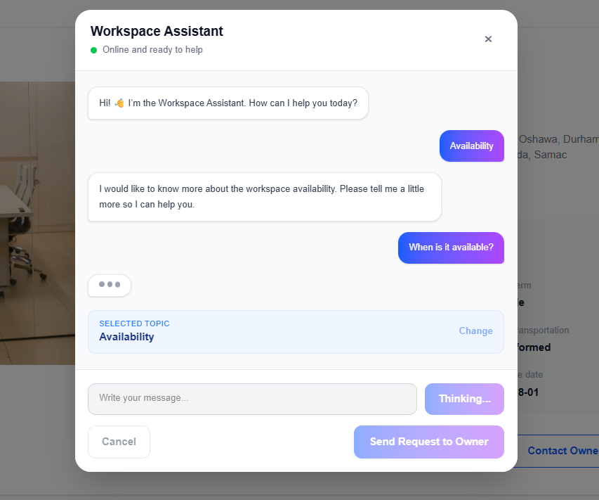
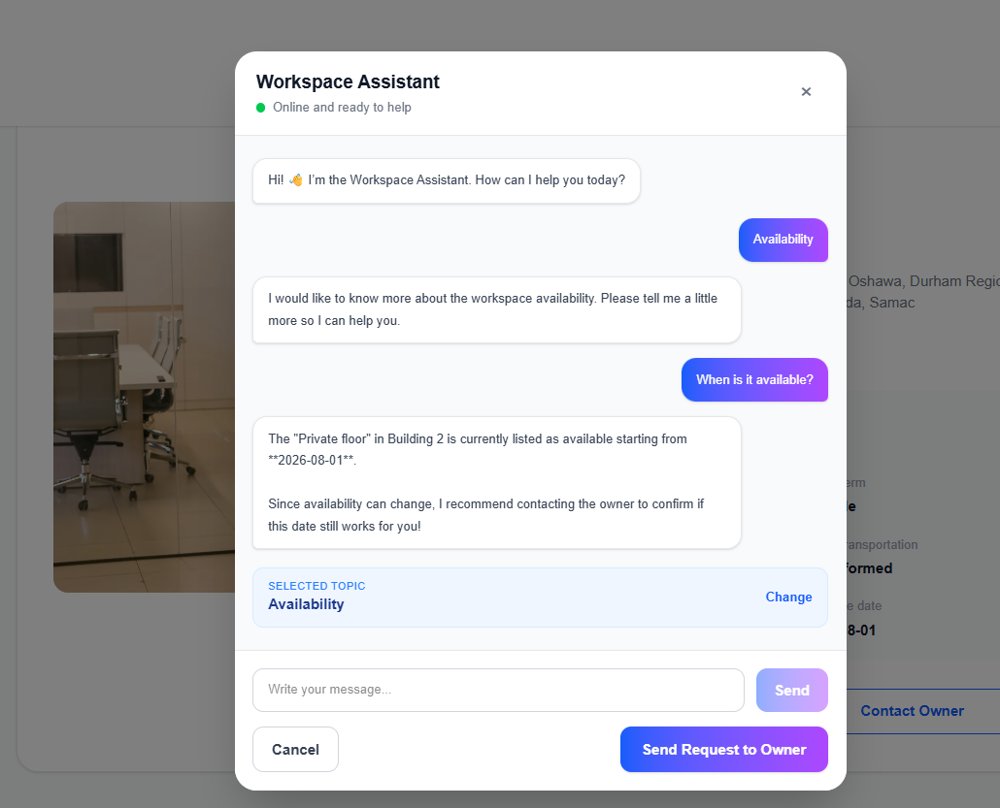


---

##  Stripe Integration

- Stripe Checkout
- Payment Success Page
- Payment Cancelled Page

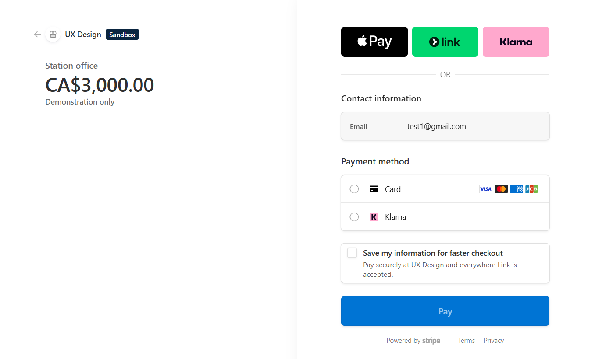

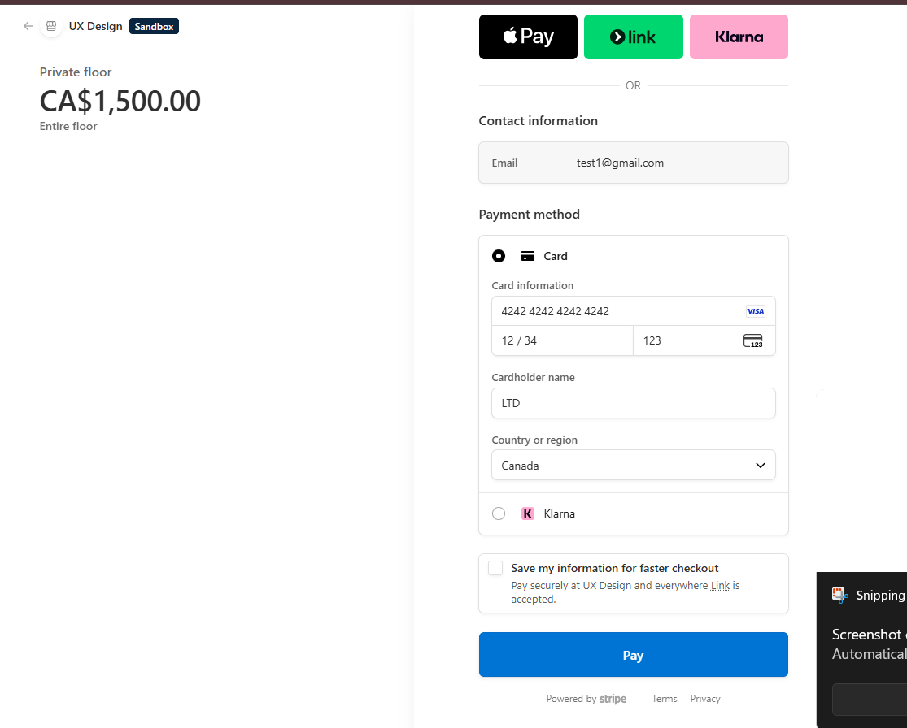

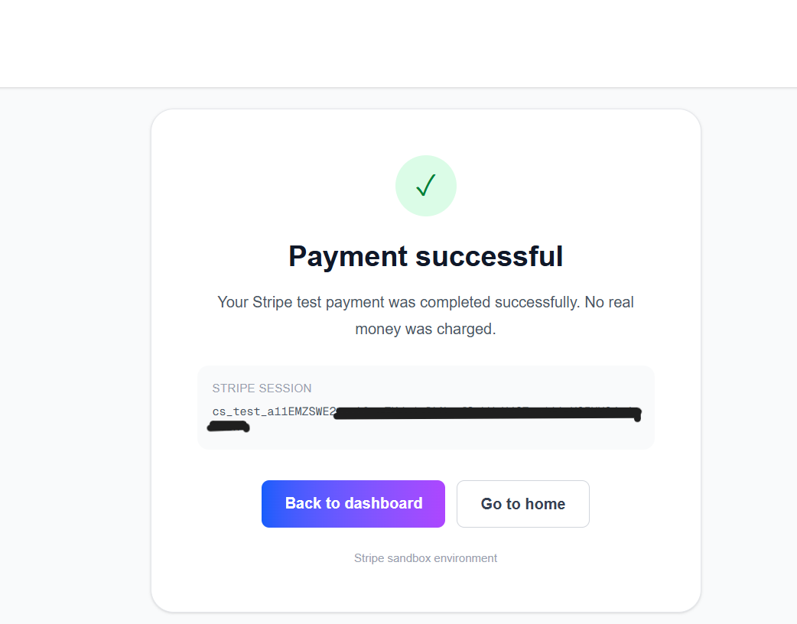

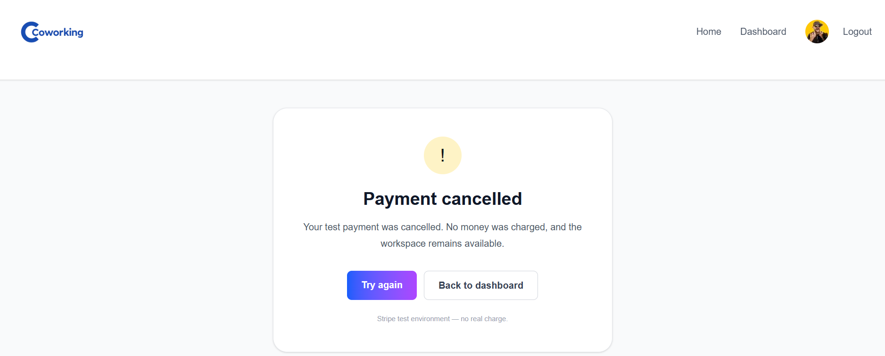


---

##  Email

Integrated with **Resend**

Automatically sends:

- AI-generated inquiry
- Customer information
- Workspace information

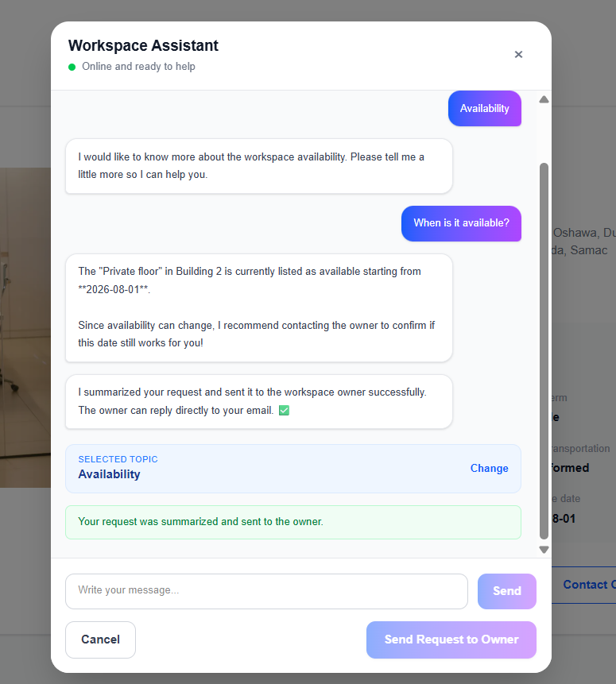

---

##  Storage

Supabase Storage

- Private bucket
- Signed URLs
- Secure image uploads

---

#  Tech Stack

### Frontend

- Next.js 16
- React 19
- TypeScript
- Tailwind CSS

### Backend

- Supabase
- PostgreSQL
- Row Level Security (RLS)

### Authentication

- Supabase Auth

### Payments

- Stripe

### AI

- OpenRouter

### Email

- Resend

### Deployment

- Vercel

---

#  Project Structure

```
app/
components/
lib/
types/
public/
```

---

# Database

Main tables:

- profiles
- properties
- workspaces
- rentals
- workspace_conversations

---

# Installation

```bash
git clone https://github.com/yourusername/coworking-app.git

cd coworking-app

npm install

npm run dev
```

---

# Environment Variables

Create a `.env.local`

```env
NEXT_PUBLIC_SUPABASE_URL=
NEXT_PUBLIC_SUPABASE_ANON_KEY=

SUPABASE_SERVICE_ROLE_KEY=

STRIPE_SECRET_KEY=
NEXT_PUBLIC_STRIPE_PUBLISHABLE_KEY=

STRIPE_WEBHOOK_SECRET=

OPENROUTER_API_KEY=

RESEND_API_KEY=
```

---

# Future Improvements

- Reviews
- Favorites
- Google Maps
- Availability Calendar
- Notifications
- Owner Analytics
- Admin Dashboard
- Chat between users

---

# Author

**Leiziane Trevisan Dardin**

Software Developer

🇧🇷 Brazilian
🇨🇦 Based in Calgary, Alberta

GitHub:
https://github.com/LeizianeTrevisanDardin

LinkedIn:
www.linkedin.com/in/leiziane-trevisan-dardin

---

# License

MIT License
